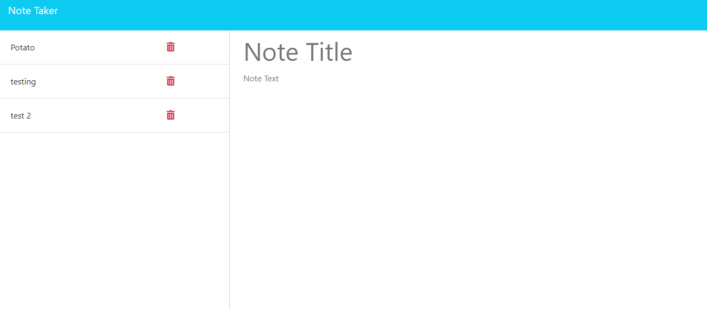

# Note Taker

## Description and Source Code

This application allows one to create a note, save it, and then look back on your notes and delete them when done. The notes can be saved using a new note button, and will appear on the left hand side of the screen when saved. If clicked on, the full note will show on the right menu.

  ## Table of Contents
  - [Installation](#installation)
  - [Credits](#credits)
  - [Contribute](#contribute)
  - [Test](#test)
  - [License](#license)

  ## Installation

  If you would like to install this code use `git clone` to clone the repository, `git status` to check if your version is up to date, or `git pull` to update any cloned code with current pushes. Site will appear as such; 

  ## Credits

  Using source code found here, [LINK](https://github.com/coding-boot-camp/miniature-eureka).

  ## Contribute

  If you would like to contribute, email me down below to be added to users who can contribute to the repository, then clone the code and create your own branch.

  ## Test
  
 To test this app, follow this [LINK](https://secure-journey-75714-c0128ad5dfd0.herokuapp.com/notes) to open the page.